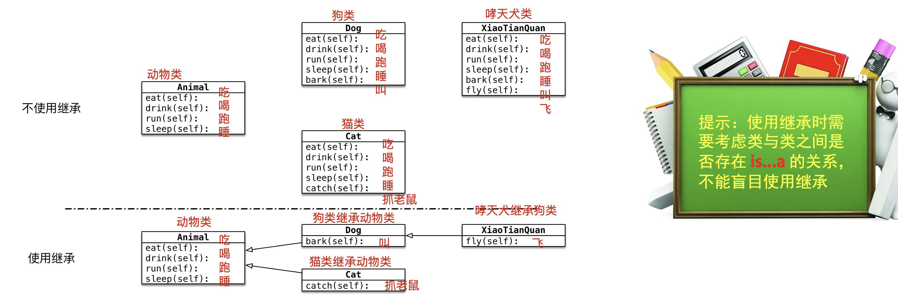

## day07 课堂笔记

## 课程之前

### 复习和反馈

```python
import random

num = random.randint(1, 10)
print(num)
# 遍历 是指 从容器中逐个取出容器中的数据
for 变量 in 容器:  # 变量 类型, 容器中的数据, 如果容器是字典, 变量是键
    pass

__str__ 魔法方法, 调用时机: print(对象) 的时候 会自动调用.  作用: 返回对象的属性信息 注意点: 必须返回一个字符串


```

### 作业


### 今日内容

```yacas
面向对象三大特征: 封装(定义类), 继承 和 多态
-	继承(重点)
-	多态(了解, 调用代码的技巧)

------
权限(在什么地方 能够使用 属性和方法): 
-	公有权限
-	私有权限

属性的划分:
-	实例属性(主要使用)
-	类属性

方法的分类:
-	实例方法(主要使用)
-	类方法(会用)
-	静态方法(不会用)
```

## 继承

### 概念介绍

```yacas
1, 继承描述的是 类与类之间的关系(is ... a)
2, 好处: 继承之后,子类对象可以直接使用父类中定义的方法和属性(减少代码冗余,提高编程效率)
```



### 继承语法

```python
class 类B(类A):  # B 继承 A, B 子类(派生类), A 父类(基类)
    pass

class 子类(父类):
    pass

# 补充
class 类名:  # 默认继承 object 类, object 类是 Python 中最原始的类
    pass
```

### 案例

```yacas
1. 定义动物类，动物有姓名和年龄属性，具有吃和睡的行为
2. 定义猫类，猫类具有动物类的所有属性和方法，并且具有抓老鼠的特殊行为 
3. 定义狗类，狗类具有动物类的所有属性和方法，并且具有看门的特殊行为
4. 定义哮天犬类，哮天犬类具有狗类的所有属性和方法，并且具有飞的特殊行为
```

```python
# 1. 定义动物类，动物有姓名和年龄属性，具有吃和睡的行为
class Animal:
    def __init__(self, name, age):
        self.name = name  # 姓名
        self.age = age  # 年龄

    def eat(self):
        print(f"{self.name} 在吃....")

    def sleep(self):
        print(f"{self.name} 在睡觉...")


# 2. 定义猫类，猫类具有动物类的所有属性和方法，并且具有抓老鼠的特殊行为
class Cat(Animal):
    def catch(self):
        print(f"{self.name} 在抓老鼠...")


# 3. 定义狗类，狗类具有动物类的所有属性和方法，并且具有看门的特殊行为
class Dog(Animal):
    def look_door(self):
        print(f"{self.name} 在看门....")


# 4. 定义哮天犬类，哮天犬类具有狗类的所有属性和方法，并且具有飞的特殊行为
class XTQ(Dog):
    def fly(self):
        print(f"{self.name} 在天上飞一会...")


# 创建动物类的对象
ani = Animal('大黄', 3)
ani.eat()
ani.sleep()
# 创建猫类的对象
cat = Cat('小白', 2)
cat.catch()  # 调用自己的方法
cat.eat()  # 调用父类的方法
cat.sleep()   # 调用父类的方法
# 创建 狗类对象
dog = Dog('小狗', 3)
dog.eat()
dog.sleep()
dog.look_door()

# 创建哮天犬类对象
xtq = XTQ('哮天犬', 1000)
xtq.fly()
xtq.eat()
xtq.sleep()
xtq.look_door()

```


### 继承的传递性

```yacas
只要是 祖先,就可以使用.
通过对象调用方法:
1, 会先在自己当前类中,查找这个方法, 找到,就直接调用
2, 如果没有找到, 会去 父类中的查找这个方法, 找到,就直接调用
3, 如果没有找到, 会去父类的父类中查找, 找到就直接调用
4, 没有找到, ....
5, 直到 object 类, 找到直接使用,
6, 没有找到,会报错(没有这个属性或者方法)
```


### 重写

```yacas
重写: 在子类中 定义和父类中名字相同的方法.
为什么重写: 因为父类中的方法,不能满足子类对象的需要.
重写的形式:
1. 覆盖
2. 扩展
```

#### 覆盖

```yacas
覆盖是指 父类中原有的功能 全部不要, 子类中全部重新定义.
步骤:
1. 在子类中定义和父类名字相同的方法
2. 在子类中直接书写新的功能代码
__str__ 
```

#### 扩展

```yacas
扩展式重写 是指 父类中原有的功能 保留,在此基础上 添加新的功能代码
步骤:
1. 在子类中定义和父类名字相同的方法
2. 在子类中,使用 super().方法名(参数)   调用父类中的方法
3. 在子类中 书写新的功能代码
```

#### 代码

```python
# 定义狗类, 名字 和 年龄的属性, 叫的方法
class Dog:
    def __init__(self, name, age):
        self.name = name  # 名字
        self.age = age  # 年龄

    def bark(self):
        print(f'{self.name}, {self.age} 岁 汪汪汪叫....')


# 定义哮天犬类,继承狗类, 嗷嗷嗷叫, 添加一个 法力值的属性
class XTQ(Dog):
    def __init__(self, name, age, mp):
        # 之前的属性还要, 直接调用父类中的 __init__方法
        super().__init__(name, age)  # 扩展式重写
        # 添加新的内容, 法力值
        self.mp = mp

    def bark(self):  # 覆盖式重写
        print(f'{self.name}修炼{self.age} 年法力值{self.mp} 嗷嗷嗷叫....')


# 创建 狗类对象
dog = Dog('小狗', 3)
dog.bark()
# 创建哮天犬类对象
xtq = XTQ('哮天犬', 10000, 998)
xtq.bark()


```


## 多态(了解)

```yacas
多态,是代码调用的小技巧.

多态:不同的子类对象调用相同的父类方法，产生不同的执行结果 (不同的对象,调用相同的方法,执行结果不一样)
```

```python
# 在 Dog 类中封装方法 game
class Dog:
    def game(self):
        print('普通狗只是简单的玩耍')


# 定义 XiaoTianDog 继承自 Dog，并且重写 game 方法
class XTQ(Dog):
    def game(self):
        print('哮天犬需要在天上玩耍')


class ErHa(Dog):
    def game(self):
        print('二哈在拆家....')


# 定义 Person 类，并且封装一个 和狗玩 的方法
class Person:
    def play_with_dog(self, d: Dog):
        print('人和狗在玩耍...', end=',')
        d.game()


# 创建狗类对象
dog = Dog()
# 创建哮天犬类对象
xtq = XTQ()
# 创建人类对象
p = Person()
# 人和普通的狗玩耍
p.play_with_dog(dog)
# 人和哮天犬玩耍
p.play_with_dog(xtq)

p.play_with_dog(ErHa())

```


## 权限(私有 和 公有)

```yacas
在 Python 中,可以对方法和 属性设置访问权限, 即规定在什么地方可以使用 这些属性和方法
```

### 公有

- 使用范围

  ```yacas
  可以在任意的地方,通过对象调用(使用)
  ```

- 定义

  ```yacas
  按照之前的方式,直接定义的属性和方法,都是 公有的
  ```

- 定义时机

  ```yacas
  在测试中,基本上所有的 都定义为公有
  ```

### 私有[理解]

- 使用范围

  ```yacas
  1, 只能在当前类(自己)的内部(class 的缩进中)使用
  2, 不能在类外部和子类中调用
  ```

- 定义

  ```yacas
  在属性或者方法名的前边 加上 两个下划线_, 这个属性或者方法 就变为私有的
  前提: 在类内部
  ```

- 定义时机

  ```yacas
  1, 某些属性或者方法(根据需求) 不想在类外部被 直接使用
  2, 写模块让别人使用,某些代码细节,不需要使用的人了解,然后将其定义私有
  ```

- 补充

  ```yacas
  因为在类外部 不能直接操作私有, 一般的做法是 定义公有方法,在类外部使用
  ```

  

```python
# 定义人类, 姓名 和 年龄
class Person:
    def __init__(self, name, age):
        self.name = name  # 姓名
        # 在属性名前边加上两个下划线前缀,就变为私有的
        if (age >= 0) and age <= 150:
            self.__age = age  # 年龄
        else:
            self.__age = 0

    def __str__(self):
        return f"姓名: {self.name}, 年龄: {self.__age}"

    # 因为 年龄属性变为私有,不能在类外部修改,只能在类内部操作, 所以定义一个公有的方法, 去修改年龄
    def set_age(self, age):
        if (age >= 0) and age <= 150:
            self.__age = age
        # else:
        #     print('输入的年龄不正确,应该在 0-150 之间')


xw = Person('小王', 18)
print(xw)
xw.__age = 10000  # 不能修改私有属性 age 了
print(xw)
xw.set_age(10000)
print(xw)


xl = Person('小李', 10000)
print(xl)

```

```yacas
1. 定义 age 为公有属性, 问题: 在类外部 可以随便修改年龄
2. 解决问题: 将 age 定义为私有属性  问题: 正常的修改也操作不了
3. 解决问题: 定义公有方法, set_age, 在方法内部判断年龄是否满足, 满足进行修改

4. 新问题: 创建对象的时候, 年龄可以随便输入,   解决: 在 init 方法中, 判断年龄的有效性
```


## 对象划分

```yacas
Python 中一切皆对象.
```

### 类对象

```yacas
类对象: 指的就是 类(就是 class 定义的类)
作用:
-	① 使用类对象 创建实例对象(实例化), 一般称为 创建对象(主要作用)
-	② 保存一些属性值信息, 称为 类属性
```

### 实例对象

```yacas
实例对象 就是 使用 类创建出来的对象(类名()), 也称为 实例 或者 对象(没有特殊强调,我们说的对象 都是 实例对象)

作用:
-	① 通过实例对象调用类中的方法
-	② 保存自己的属性信息值(实例属性)
```

## 属性划分

### 类属性

- 概念

  ```yacas
  就是类对象具有的属性, 称为类属性
  ```

- 定义

  ```yacas
  一般写法, 在类内部、方法的外部(def 的缩进外) 定义的变量, 就是类属性, 一般写在类的开头
  ```

- 调用

  ```yacas
  # 获取
  	类名.类属性
  	补充: 实例对象 也可以获取类属性的值, 前提,没有和类属性名字相同的实例属性(即实例对象查找属性的时候, 先找实例属性,找到就用,找不到,找类属性,找到就用,找不到,报错)
  # 修改
  	类名.类属性 = 属性值
  ```

- 内存

  ```yacas
  类属性, 在内存中 只有一份
  ```

### 实例属性

- 概念

  ```yacas
  就是实例对象具有的属性, 称为实例属性
  ```

- 定义

  ```yacas
  在类中 的 init 方法中, 使用 self 定义的属性
  ```

- 调用

  ```yacas
  # 获取
  	实例对象.属性名  
  # 添加和修改
  	实例对象.属性名 = 属性值
  ```

- 内存

  ```yacas
  每个实例对象中都存在一份自己的属性信息
  ```

### 定义时机

```yacas
如何判断将一个属性定义为 类属性还是实例属性?
1, 基本上所有的属性都为 实例属性
2, 实例属性 描述的是每个对象自己具体的信息, 类属性 描述的是整个类 的信息(类中所有对象 这个属性值都一样)
3, 看这个属性值信息对于所有的该类对象是否都一样,并且同时变化, 如果是就定义为 类属性,否则就定义为实例属性
```

### 需求

```yacas
1. 定义一个 工具类
2. 每件工具都有自己的 name
3. 需求 —— 知道使用这个类，创建了多少个工具对象?
```

```yacas
类名: 工具类 Tools
属性: 名字 name(实例属性), 创建对象的个数 count (类属性)
方法: __init__
```

```python
class Tools:
    # 在类内部,方法外部,直接定义的变量,就是类属性
    count = 0

    def __init__(self, name):
        self.name = name  # 名字
        # 每创建一个对象.就会调用 init 方法, 所以在这个方法中,对类属性进行加1操作
        Tools.count += 1


# 创建对象
print(f'当前创建的工具对象个数为: {Tools.count}个')
t1 = Tools('扳手')  # 创建一个对象之后, 个数应该加1,
print(f'当前创建的工具对象个数为: {Tools.count}个')
t2 = Tools('锤子')
print(f'当前创建的工具对象个数为: {Tools.count}个')


```


## 方法的划分

### 实例方法[掌握]

- 定义

  ```yacas
  直接使用 def 关键字定义的方法, 称为是 实例方法
  ```

  ```python
  class 类名:
      def 方法名(self):  # 实例方法, 第一个参数,一般写作 self, 表示 对象
          pass
  ```

- 调用

  ```yacas
  实例对象.方法名()
  ```

- 定义时机

  ```yacas
  1, 一般来说,所有的方法 都可以定义为 实例方法
  2, 如果方法中,使用了 实例属性(即 self), 这个方法 必须 定义为 实例方法
  ```

### 类方法[掌握]

- 定义

  ```yacas
  在 def 的上方 使用 装饰器 @classmethod 装饰的方法,称为类方法
  ```

  ```python
  class 类名:
      @classmethod
      def 方法名(cls):  # 类方法, 第一个参数一般写作 cls,表示的是 类对象,即类名,不需要手动传递
          pass
  ```

- 调用

  ```yacas
  方法一:
  类名.方法名()
  
  方法二:
  实例对象.方法名()
  ```

- 定义时机

  ```yacas
  前提: 方法中没有使用 实例属性
  但是,使用了 类属性,此时, 可以 将这个方法 定义为 类方法, 
  ```

  

### 静态方法[了解]

- 定义

  ```yacas
  在 def 的上方,使用 装饰器 @staticmethod 装饰的方法,称为静态方法
  ```

  ```python
  class 类名:
      @staticmethod 
      def 方法名():  # 静态方法, 一般 没有参数有参数的话,就需要手动传递
          pass
  ```

- 调用

  ```yacas
  方法一:
  类名.方法名()
  
  方法二:
  实例对象.方法名()
  ```

- 定义时机

  ```yacas
  方法中 即 没有使用 实例属性, 同时 也没有使用类属性
  此时, 可以  将这个方法 定义为 静态方法
  ```

  

### 代码

```python
class Tools:
    count = 0  # 类属性, 统计 对象的个数

    def __init__(self, name):
        self.name = name
        Tools.count += 1  # 创建对象之后, 个数加1

    # 定义类方法
    @classmethod
    def show_tool_count(cls):  # cls 就是类对象,就是类,调用和 self 不需要传参
        print(f"当前对象的个数为: {cls.count} 个")

    # 定义静态方法
    @staticmethod
    def show_info():
        print('这是一个工具类')


# 查看当前对象的个数 (调用类方法)
Tools.show_tool_count()
t1 = Tools('洛阳铲')
# 可以使用对象 来调用类方法
t1.show_tool_count()
# 调用静态方法
Tools.show_info()
t1.show_info()


```


## 案例

```yacas
1. 设计一个 Game 类 (类名)
2. 属性:
• 定义一个 top_score 类属性 -> 记录游戏的历史最高分
• 定义一个 player_name 实例属性 -> 记录当前游戏的玩家姓名
3. 方法:
• 静态方法 show_help() -> 直接打印  这是游戏帮助信息
• 类方法 show_top_score() -> 显示历史最高分
• 实例方法 start_game() -> 开始当前玩家的游戏
-	3.1 输出 玩家 xxx 开始游戏
-	3.2 使用随机数,生成 10 - 100 之间的随机数字作为本次游戏的得分
-	3.3 打印 玩家 xxx 本次游戏得分 xxx
-	3.4 判断本次游戏得分和最高分之间的关系

4. 主程序步骤: __main__
	1 查看帮助信息
	2 查看历史最高分
	3 创建游戏对象，开始一次游戏
	4.查看最高分
	5.再开始一次游戏
	6.查看最高分
	7.再开始一次游戏
	8.查看最高分
```

```python
import random


# 1. 设计一个 Game 类 (类名)
class Game:
    # • 定义一个 top_score 类属性 -> 记录游戏的历史最高分
    top_score = 0

    def __init__(self, name):
        # • 定义一个 player_name 实例属性 -> 记录当前游戏的玩家姓名
        self.player_name = name

    # • 静态方法 show_help() -> 直接打印  这是游戏帮助信息
    @staticmethod
    def show_help():
        print('这是游戏帮助信息')

    # • 类方法 show_top_score() -> 显示历史最高分
    @classmethod
    def show_top_score(cls):
        print(f"历史最高分为: {cls.top_score}")

    # • 实例方法 start_game() -> 开始当前玩家的游戏
    def start_game(self):
        # -	3.1 输出 玩家 xxx 开始游戏
        print(f"玩家 {self.player_name} 开始游戏")
        # -	3.2 使用随机数,生成 10 - 100 之间的随机数字作为本次游戏的得分
        score = random.randint(10, 100)
        # -	3.3 打印 玩家 xxx 本次游戏得分 xxx
        print(f"玩家 {self.player_name} 本次游戏得分 {score}")
        # -	3.4 判断本次游戏得分和最高分之间的关系
        if score > Game.top_score:
            Game.top_score = score


# 4. 主程序步骤: __main__
if __name__ == '__main__':
    # 	1 查看帮助信息
    Game.show_help()
    # 	2 查看历史最高分
    Game.show_top_score()
    # 	3 创建游戏对象，开始一次游戏
    player = Game('小王')
    player.start_game()
    # 	4.查看最高分
    player.show_top_score()
    # 	5.再开始一次游戏
    player.start_game()
    # 	6.查看最高分
    player.show_top_score()
    # 	7.再开始一次游戏
    player.start_game()
    # 	8.查看最高分
    player.show_top_score()


```


