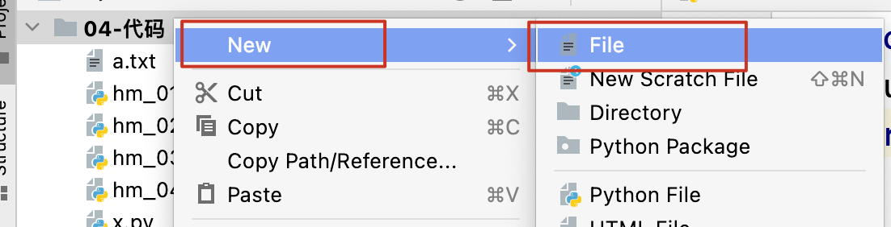
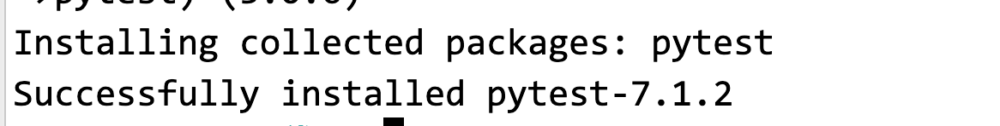

## day08 课堂笔记

## 课程之前

### 复习和反馈


### 作业

```python
if cls.top_score != 0:  # 数字为 0 是 False, 不为 0 是 True
    print('True, xxxx')
else:
    print('False')
    
if cls.top_score:  # 数字为 0 是 False, 不为 0 是 True
    print('True, xxxx')
else:
    print('False')    
```


### 今日内容

```yacas
文件操作(使用 代码对文件进行读取)
-	普通的文件读写
-	json文件(重点掌握)

异常(程序代码中的错误)
-	异常捕获(重点)
```


## 文件操作

### 介绍

```yacas
1, 文件: 可以存储在长期存储设备(硬盘, U盘) 上的一段数据即为文件
2, 计算机只认识 二进制(0 和 1), 计算机也只能存储二进制数据(在计算机存储的数据都是以二进制的形式 存储的)
3, 我们使用软件打开 看到的不是 0 和 1, 原因是 打开文件的软件会自动的将二进制数据进行转换
4, 根据能否使用 文本软件(记事本) 打开文件,将文件分为两类
-	文本文件(能使用记事本打开), 比如: .txt, .py, .md(markdown)
-	二进制文件(不能使用记事本打开的),比如: 音频(mp3) 视频(mp4, avi, rmvb ..), 图片(jpg, png, gif )  等

主要研究 文本文件
```


### 文件操作

#### 步骤

```yacas
1, 打开文件
2, 读/写文件
3, 关闭文件(保存)
```

#### 1. 打开文件

```yacas
文件 是在 硬盘 中存储的, 打开文件,可以理解为 将硬盘中文件 加载到内存中
在 Python 中打开文件 使用的方法是 open() 函数
```

```python
open(file, mode='r', encoding=None)  # 打开文件
-	file: 要打开的文件, 类型 str, 可以使用相对路径, 也可以使用绝对路径
    -	相对路径, 从当前代码所在的目录开始书写的路径(./ 当前目录  ../ 上一级目录)
    -	绝对路径, 从盘符根目录(C: D: E:)开始书写的路径
- 	mode: 打开文件的方式
    - 	'r',read 只读打开, 文件只能读取,不能写入, 文件不存在, 会报错
    -	'w',write 只写打开, 文件只能写入,不能读取, 文件不存在,会创建文件,文件存在,会覆盖原文件
    -	'a',append 追加打开, 只能在文件的末尾写入内容,文件不存在,会创建文件
- 	encoding, 编码方式. 简单理解 二进制 和汉字之间如何进行转换的
	- gbk, 将一个汉字 转换为 2 个字节的二进制
    - utf-8(使用最多), 将一个汉字转换为 3 个字节的二进制
    (byte 字节: 计算机中基本的存储单位, 1KB = 1024 Byte)
- 返回值: 返回一个 文件对象, 后续对文件的操作,都需要这个文件对象
    
# 变量 = open(文件名, 打开方式, encoding='utf-8')  # 变量 就是 文件对象
```

#### 2. 读写文件

##### 读文件

```python
变量 = 文件对象.read()   # 将文件中内容全部读取
# 返回值就是读取到的文件内容,类型是 字符串
```

```python
with open('a.txt', 'r', encoding='utf-8') as f:
    result = f.read()
    print(result)
```

##### 写文件

```python
文件对象.write('写入的内容')  # 写入的内容需要是一个字符串
```

```python
# # 1. 打开文件
# f = open('a.txt', 'w', encoding='utf-8')
# # 2. 写文件
# f.write('好好学习\n')
# f.write('天天向上')
# # 3. 关闭文件
# f.close()


with open('a.txt', 'w', encoding='utf-8') as f:
    f.write('good good study')

```

##### 追加文件

```python
with open('a.txt', 'a', encoding='utf-8') as f:
    f.write('\nday day up')
```

#### 3. 关闭文件

```yacas
关闭文件的同时,会保存文件, 同时会清理内存中的资源
文件对象.close()
```


### 打开文件的推荐写法

```python
with open(文件, 打开方式, encoding='utf-8') as 变量:  # 变量,就是文件对象
    书写对文件的操作
    
# 好处,不用书写关闭文件的代码, 会自动关闭文件
# 关闭时机: with 缩进中的代码 执行完成,会关闭(出了 with 的缩进后会关闭)
```

### 按行读取文件

```yacas
一次读取一行内容,文件指针(光标)会移动到这行的末尾
文件对象.readline()  
------
read() 和 readline() 读到文件末尾,返回空字符串 ""
```

- 需求

  ```yacas
  模拟读取大文件:
  文件内容有很多行,每次读取一行,读完位置
  ```

- 代码

  ```python
  with open('a.txt', encoding='utf-8') as f:
      for i in f:  # 文件对象 是可以直接遍历的, i 就是一行的内容
          print(i, end='')
  
  with open('a.txt', encoding='utf-8') as f:
      while True:
          result = f.readline()
          # 判断 result 的结果是否是空字符串, 如果是空字符串表示读到文件末尾,直接退出循环
          if result == '':
              break
          
          print(result, end='')
          
          
  with open('a.txt', encoding='utf-8') as f:
      while True:
          result = f.readline()
          # 判断 result 的结果是否是空字符串, 如果是空字符串表示读到文件末尾,直接退出循环
          # 空字符串是 False, 非空字符串是 True
          # if result == '': 
          # if not result != '':  # result != '' 表示读到内容, 没有读到文件末尾, 加上 not 就是取反
          if not result:  # result(1. 有内容为 True, 加上 not变为 False 2, 没有内容即空字符串, 是 False, 加上 not,变为 True)
              break
  
          print(result, end='')        
  ```

## Json 操作(重点)

```yacas
1, json 文件 也是文本文件, 那么可以使用 read 和 write 函数 来操作,只是不方便而已
2, json 文件的格式比较特殊,像 Python 中字典和列表.
3, json 一种基于文本，独立于语言的轻量 级数据交换格式。
-	基于文本的, 文本文件,不包含图片,音视频
-	独立于语言, 是指不是某种语言特有的,是所有编程语言都可以使用的
-	轻量级, 定义相同的数据量, json 占用的文件比较小
-	数据交换格式, 前端和后端 的数据交互的格式
4, 在自动化测试中经常用来存放 测试数据，文件后缀名为: .json
```

### json 语法

```yacas
1, json 中的数据类型
    对象 {}	---> Python 字典
    数组 []	---> Python 列表
    字符串 "",必须使用双引号	
    数字类型	---->python int, float
    布尔类型 true, false ---> python True ,False 
    空 null 		----> python  None
2, json 文件中, 是一个对象{}或者数组[], 对象和数字可以相互嵌套
3, json 对象 是由键值对组成的, 键 必须是 字符串
4, json 中数据与数据之间使用逗号隔开, 最后一个数据后边不能写逗号
```

### json 定义

```yacas
我叫小明,我今年 18 岁,性别男, 学校 空, 爱好 听歌,吃饭,打豆豆, 我的居住地址为 国家 中国, 城市 北京.
```



```json
{
  "name": "小明",
  "age": 18,
  "isMan": true,
  "school": null,
  "hobby": ["听歌", "吃饭", "打豆豆"],
  "address": {
    "country": "中国",
    "city": "北京"
  }
}
```

### Json 文件读取

```yacas
1, json 文件是一个文本文件,可以使用 read 读取, 得到的数据是 字符串类型,提取数据很麻烦
2. 所以 存在一个专门读取 json 文件的方法, 可以直接得到列表或者字典(根据 json 文件来决定的)
步骤:
1. 导包 import json 
2. 读打开文件
3. 使用 json.load(文件对象)  来读取 json 文件  --> 列表或者字典
```

```python
import json

with open('data.json', encoding='utf-8') as f:
    result = json.load(f)
    print(type(result))
    print(result)
    # 姓名
    print(result.get('name'))
    # 年龄
    print(result.get('age'))
    # 取出第一个爱好
    print(result.get('hobby')[0])
    # 取出国家
    print(result.get('address').get('country'))
```

### 练习

```yacas
1. 先定义 info.json 文件 
我叫小明,我今年 18 岁,性别男, 爱好 听歌, 吃饭,打豆豆,
我的居住地址为 国家中国, 城市广州.   ---> 对象

我叫小红,我今年 17 岁,性别女, 爱好 听歌, 学习,购物
我的居住地址为 国家 中国, 城市北京.   ---> 对象
-----
2. 使用 Python 代码 读取 每个人的姓名, 年龄 性别, 城市 
```

- info.json

  ```json
  [
    {
      "name": "小明",
      "age": 18,
      "isMan": true,
      "hobby": ["听歌", "吃饭", "打豆豆"],
      "address": {
        "country": "中国",
        "city": "广州"
      }
    },
    {
      "name": "小红",
      "age": 17,
      "isMan": false,
      "hobby": ["听歌", "学习", "购物"],
      "address": {
        "country": "中国",
        "city": "北京"
      }
    }
  ]
  ```
  
- 代码文件

  ```python
  import json
  
  with open('info.json', encoding='utf-8') as f:
      data = json.load(f)  # list
      for d in data:  # d 字典
          # if d.get('isMan') == True:
          # if d.get('isMan') is True:
          # if d.get('isMan'):
          #     sex = '男'
          # else:
          #     sex = '女'
          sex = '男' if d.get('isMan') else '女'
  
          print(f"姓名: {d.get('name')}, 年龄: {d.get('age')}, "
                f"性别: {sex}, 城市: {d.get('address').get('city')} ")
  
  ```
  
  

### json 的写入[了解]

```yacas
是指将 Python 中的字典或者列表 直接写入 json 文件
步骤:
1, 导包 import json 
2, 只写'w'打开文件
3, 使用 json.dump(Python 中的列表或者字典, 文件对象) 保存文件
```

```python
import json

info = {'name': "张三", 'age': 18, 'isMan': True, 'like': ['11', '22']}

with open('info2.json', 'w', encoding='utf-8') as f:
    # json.dump(info, f)
    # json.dump(info, f, ensure_ascii=False)
    json.dump(info, f, ensure_ascii=False, indent=2)


```


## 异常

### 介绍

```yacas
程序在运行时, 如果Python解释器遇到到一个错误, 则会停止程序的执行, 并且提示一些错误信息, 这就是异常.
程序遇到异常会终止程序的执行.

程序停止执行并且提示错误信息这个动作, 通常称之为: 抛出 (raise) 异常

异常类型: 错误描述信息
FileNotFoundError: [Errno 2] No such file or directory: 'aa.txt'
ValueError: invalid literal for int() with base 10: '10.1'
```

### 捕获异常

```yacas
程序代码执行遇到异常,程序就会结束执行.
捕获异常 是指,当程序发生异常的时候, 不让其报错停止,让其继续执行,但可以记录这个错误信息
```

#### 捕获异常的基本语法

```python
try:
    可能发生异常的代码
except:
    发生了异常执行的代码
```

- 需求

  ```yacas
  1. 获取用户从键盘输入的数据
  2. 转换数据类型为整数
  3. 数据转换类型正确时, 输出数据内容
  4. 数据转换类型错误时, 提示输入正确数据
  ```

- 代码

  ```python
  try:
      # 1. 获取用户从键盘输入的数据
      num = input('请输入一个数字:')
      # 2. 转换数据类型为整数
      num = int(num)
      # 3. 数据转换类型正确时, 输出数据内容
      print(num)
  # 4. 数据转换类型错误时, 提示输入正确数据
  except:
      print('请输入一个整数数字.')
  
  ```


#### 捕获指定类型的异常

```yacas
代码中可能出现多个类型的异常 , 需求是针对不对类型的异常,进行不同的处理结果.
```

```python
try:
    可能发生异常的代码
except 异常类型1:
    发生了异常类型1, 执行的代码
except 异常类型2:
    发生了异常类型2, 执行的代码
except ....:
    pass
```

```python
try:
    # 1. 获取用户从键盘输入的数据
    num = input('请输入一个数字:')
    # 2. 转换数据类型为整数
    num = int(num)
    # 3. 数据转换类型正确时, 输出数据内容
    a = 10 / num
    print(a)
except ValueError:
    print('请输入正确的数字')
except ZeroDivisionError:
    print('除数不能为 0')


# ZeroDivisionError
# ValueError

```

### 捕获未知类型的异常 [使用较多]

```yacas
可以捕获任意类型的异常,并能获取并打印错误信息
```

```python
try:
    可能发生异常的代码
except Exception as 变量: # Exception 是常见异常类的祖宗
    print(变量)
```

```python
try:
    # 1. 获取用户从键盘输入的数据
    num = input('请输入一个数字:')
    # 2. 转换数据类型为整数
    num = int(num)
    # 3. 数据转换类型正确时, 输出数据内容
    a = 10 / num
    print(a)
except Exception as e:
    print('发生了异常', e)
```

### 异常捕获的完整格式

```python
try:
    可能发生异常的代码
except 异常类型:
    发生了指定异常类型,执行的代码
except Exception as 变量:
    发生了其他类型的异常执行的代码
else:
    没有发生异常,执行的代码
finally:
    不管有没有发生异常,都会执行的代码
```

```python
1. 获取用户输入的数字(input)
2. 判断获取的数字是否整数 (方式 1. 直接使用 int() 类型转换,没有发生异常就是整数,      方式2, 字符串.isdigit() 用来判断字符串是否都是纯数字)
3. 如果不是整数, 提示输入错误
4. 如果是整数, 则进一步判断是奇数还是偶数
5. 最终提示: 程序运行结束  

```

```python
try:
    num = input('请输入一个数字:')
    num = int(num)
except Exception as e:
    print('输入有误')
else:
    # 是整数
    if num % 2 == 0:
        print('偶数')
    else:
        print('奇数')
finally:
    print('程序结束')
```

```python
num = input('请输入数字:')
if num.isdigit():
    # 类型转换
    num = int(num)
    # 判断奇偶
    if num % 2 == 0:
        print('偶数')
    else:
        print('奇数')
else:
    print('输入有误')

print('程序运行结束')
```


```yacas
pip install pytest -i https://pypi.douban.com/simple
```


