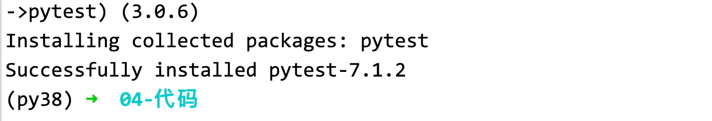
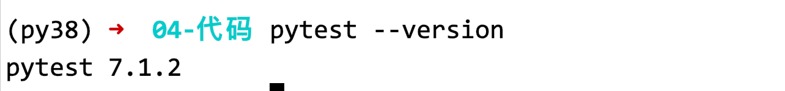
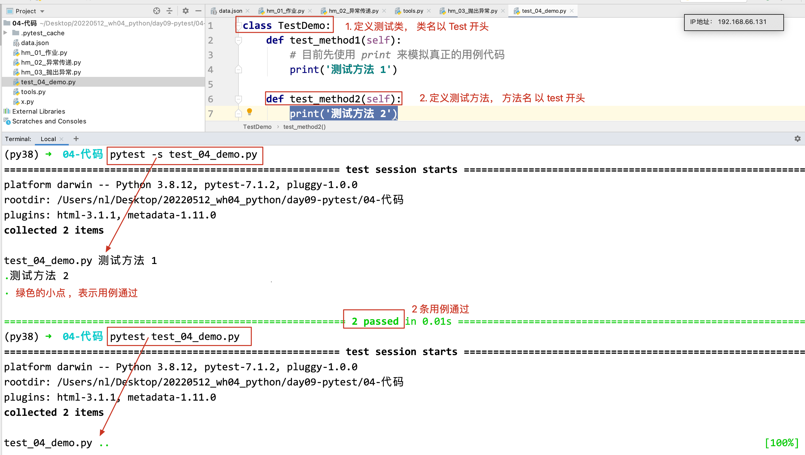

## day09 课堂笔记

## 课程之前

### 复习和反馈

### 作业

### 今日内容

```yacas
异常:
	异常传递(知道, 理解)
	抛出异常(知道)
pytest 框架的学习(管理用例的)
```


## 异常

### 异常的传递[理解]

```yacas
异常传递: 在函数的嵌套调用过程中, 如果内部函数发生了异常,没有捕获,会将这个异常传递到外层函数(函数调用的地方), .... 一直向外传递, 直到被捕获,或者最终报错

不需要我们自己代码实现, Python 底层已经实现的,我们只需要知道 异常会向外传递.
```

### 抛出异常

```yacas
1, 抛出异常: 代码程序停止执行,并提示错误信息,就是抛出异常.
简单说: 程序代码之所以会停止执行,会报错, 是因为代码执行 遇到了抛出异常的代码
2, Python 中抛出异常 使用的关键字 是 raise,(简单理解,程序代码执行 遇到 raise , 代码就会停止,报错)  (raise Exception('错误信息'))
3, 使用场景: 将来 我们自己书写代码模块,让别人使用, 为了规范使用者使用(参数是否满足要求等),只有满足我们的要求, 代码才能继续向下执行,如果不满足, 就抛出异常,终止代码的执行
----
写代码功能模块的人 抛出异常,  调用代码的人 捕获异常

```

- 需求

  ```yacas
  案例:提示用户 输入密码，如果 长度少于 8，抛出 异常
  - 书写一个模块, 模块中 功能代码 输入密码(我们提供这个函数让别人使用) 密码长度至少 8 位
  ```

- tools

  ```python
  def set_password():
      pwd = input('请输入密码长度最少8位:')
      if len(pwd) >= 8:
          return pwd
      else:
          # 抛出异常
          raise Exception('密码长度不足 8 位')
  
  ```
  
- 新代码

  ```python
  from tools import set_password
  
  print("其他代码")
  # 调用别人写好的设置密码的功能 来设置密码
  print(set_password())
  print("其他代码")
  ```

## pytest 框架

### 介绍

**框架**

```yacas
1. 框架英文单词framework  2. 为解决一类事情的功能集合
```

**pytest 框架**

```yacas
pytest 框架 单元测试框架(一般开发做的), 是第三方的框架, 想要使用需要安装
我们使用 pytest 来作为自动化测试执行框架(管理测试用例, 执行测试用例, 生成测试报告)


unittest 框架: 也是单元测试框架,也可以用来 管理用例, 执行用例,生成测试报告. 自带的框架,不需要安装,即可使用.

测试流程: 需求评审、编写测试计划、书写测试用例、执行测试用例、管理缺陷、生成测试报告

pytest 框架参与的步骤是： 书写测试用例(使用代码完成的用例)、执行测试用例、生成测试报告
```

**使用框架的好处**

```yacas
1. 能够组织多个用例去执行 
2. 方便实现参数化
3. 能够生成测试报告
```


### 安装

```yacas
在Python 中安装包(第三方框架),使用的工具是 pip 命令(只要安装了 Python, 自动安装)
在 cmd(终端) 中 执行(win r  cmd 回车)
pip install pytest 
Mac 系统: pip3 install pytest
# 默认下载的地址是国外的地址, 下载比较慢, 可以指定使用国内下载

清华大学：https://pypi.tuna.tsinghua.edu.cn/simple
阿里云：http://mirrors.aliyun.com/pypi/simple/
豆瓣：https://pypi.douban.com/simple/
pip install -i 下载源 包名

pip install -i https://pypi.tuna.tsinghua.edu.cn/simple pytest   

pip uninstall 包名
pip show 包名
pip list # 查看所有安装的内容
```





### Pytest 用例的书写

```yacas
pytest 是用来管理测试用例(代码书写的用例)的.
书写用例的步骤:
1, 定义测试类(建议 类名以 Test开头)
2, 书写测试方法, 即真正的用例代码(建议 方法名以 test 开头)
3, 执行用例

--------
要求: 测试用例的代码文件名 不要使用中文, 遵循标识符的规则
文件名 建议 以 test 开头 或者 结尾
```

```python
class TestDemo:
    def test_method1(self):
        # 目前先使用 print 来模拟真正的用例代码
        print('测试方法 1')

    def test_method2(self):
        print('测试方法 2') 
```


### 执行测试用例

#### 方法一  在终端使用命令行运行

```yacas
pytest -s 用例代码文件
# -s 的作用,输出显示 代码中的 print,即如果没有 -s 选项, print() 的代码不会显示
```



#### 方法二 在主函数中执行

```python
if __name__ == "__main__": #  主函数
    pytest.main(['-s', '用例代码文件'])
    
# 书写了主函数,就可以右键运行了
```

```python
import pytest


class TestDemo:
    def test_method1(self):
        # 目前先使用 print 来模拟真正的用例代码
        print('测试方法 1')

    def test_method2(self):
        print('测试方法 2')


if __name__ == '__main__':
    pytest.main(['-s', 'test_05_demo.py'])
```

### 使用配置文件 运行

~~~yacas
1, 配置文件的名字一般写作 pytest.ini 
2, 配置文件必须创建在代码的根目录中(最大的目录)
3, 配置文件中 第一行 必须 是 [pytest], 表示是 pytest 的配置文件
4, 有了配置文件后,之后终端中运行,都会调用配置文件
5, 注意事项, windows 下定义 pytest.ini  书写中文注释可能会报错(编码的问题),
~~~

~~~python
[pytest]  # 第一行固定,必须是 这个
# 添加命令行参数 add options
addopts = -s
# 用例代码所在的路径(相对于 配置文件的相对路径)
testpaths = xxx
# 用例代码文件的名字,可以使用 * 通配符, (*表示任意个任意字符)
python_files = test*.py  
# 测试类的名字, 以什么开头
python_classes = Test* 
# 测试方法名 
python_functions = test*
~~~

~~~ini
[pytest]
# 选项
addopts = -s
# 文件所在目录
testpaths = scripts/
# 文件名
python_files = test*.py
# 测试类名
python_classes = Test*
# 测试方法名
python_functions = test*
~~~

  

### 案例: 加法测试

```python
def add(a, b):
    return a + b

# 测试数据:
0, 10, 10
1, 5, 6
9, 7, 16
```

```python
def add(a, b):
    return a + b
```

```python
from tools import add


class TestAdd:
    def test_1(self):
        # 判断预期结果和实际结果是否相等
        if 10 == add(0, 10):
            print('0, 10, 10 用例通过')
        else:
            print('0, 10, 10 用例不通过')

    def test_2(self):
        # 判断预期结果和实际结果是否相等
        if 6 == add(1, 5):
            print('1, 5, 6 用例通过')
        else:
            print('1, 5, 6  用例不通过')

    def test_3(self):
        # 判断预期结果和实际结果是否相等
        if 16 == add(9, 7):
            print('9, 7, 16 用例通过')
        else:
            print('9, 7, 16 用例不通过')
```

~~~yacas
1, pytest.ini  必须放在最外面，是一个整体的项目，对这个项目整体进行控制
2，pytest.ini 中的参数不要写错，每个参数都有自己的含义
3，所有参数共同结合，决定你能不能找到测试用例，去执行
4，用例所在的目录 设为（目录中包含一个__init__.py 文件）
~~~


### 断言

~~~yacas
断言: 让程序代码自动判断预期结果和实际结果是否相符.

如果相符,则断言成功,用例通过.
如果不相符, 则断言失败,用例不通过,抛出异常 

pytest 中的 断言使用的是 assert 关键字
语法: 
assert 条件   # if 语句中的条件,都可以用在这里
- 如果条件为 True, 断言成功,用例通过
- 如果条件为 False, 断言失败,用例不通过,抛出异常

常用：
断言是否相等：
assert 预期结果 == 实际结果   # 是否相等

断言是否包含
assert 预期结果 in 实际结果   # 预期结果是否包含在实际结果中
~~~


~~~python
from tools import add


class TestAdd:
    def test_add_1(self):
        print('0, 10, 10')
        if 10 == add(0, 10):
            print('0, 10, 10 通过')
        else:
            print('0, 10, 10 不通过')

    def test_add_2(self):
        print('1, 5, 6')
        if 6 == add(1, 5):
            print('1, 5, 6 通过')
        else:
            print('1, 5, 6 不通过')

    def test_add_3(self):
        print('9, 7, 16')
        if 17 == add(9, 7):
            print('9, 7, 16 通过')
        else:
            print('9, 7, 16 不通过')
~~~


### 参数化

~~~yacas
在测试方法中,使用数据的地方,使用参数来代替,然后在运行的时候 传递实参值.

# 1. 将用例中的数据 变为参数书写
# 2. 组织测试数据 ---> [(), (), ()] 或者 [[], []], 内部的元组或者列表 就是一组测试数据
# 3. 使用装饰器完成参数化
@pytest.mark.parametrize('参数1, 参数2, ...', 测试数据)
~~~

~~~python
import pytest

from tools import add


data_list = [(0, 10, 10), (1, 6, 7), (9, 7, 16), (10, 10, 21)]


class TestAdd:
    @pytest.mark.parametrize('a, b, expect', data_list)
    def test_add(self, a, b, expect):
        print(f'{a}, {b}, {expect}')
        assert expect == add(a, b)
~~~


### 分目录处理

~~~yacas
pytet.int 放在最外层,pytest配置文件
测试数据 单独一个目录data
读取测试数据 一般放在common包中，或者最外层
用例代码（脚本）一般script（case）包中
测试报告的目录 report目录
~~~

* Pytest.ini 文件

  ~~~ini
  [pytest]
  addopts = -s
  testpaths = ./scripts
  python_files = test_add_3.py
  python_classes = Test*
  python_functions = test*
  ~~~

* 测试数据文件  `data/add.json`

  ~~~json
  [
    [1, 2, 3],
    [2, 3, 5],
    [3, 4, 7]
  ]
  ~~~

* `common/read_data.py`

  ~~~python
  import json
  from config import BASE_DIR
  
  
  def build_data():
      # with open('/Users/nl/Desktop/20220705_wh_05_python/day09-pytest/04-代码/data/add.json', encoding='utf-8') as f:
      with open(BASE_DIR + '/data/add.json', encoding='utf-8') as f:
          data = json.load(f)  # [[], []]
  
      return data
  
  
  if __name__ == '__main__':
      print(build_data())
  ~~~

* 用例文件

  ~~~python
  import pytest
  
  from common.read_data import build_data
  from tools import add
  
  
  class TestAdd:
      @pytest.mark.parametrize('a, b, expect', build_data())
      def test_add(self, a, b, expect):
          print(f'{a}, {b}, {expect}')
          assert expect == add(a, b)
  ~~~

* `tools.py` 要测试的代码

  ~~~yacas
  在接口测试中，一般是放在api的包中
  ~~~

  ~~~python
  def add(a, b):
      return a + b
  ~~~

* `config.py` 项目的配置文件

  ~~~python
  import os
  
  BASE_DIR = os.path.dirname(__file__)
  
  
  if __name__ == '__main__':
      print(BASE_DIR)
  
  ~~~

~~~yacas
1. 书写测试用例（定义在script包中；文件名建议以test开头或者结尾；类名以Test开头；方法名以test开头）
2. 执行用例（终端中使用pytest -s script/用例文件名.py执行；（配置文件执行；文件名必须叫pytest.ini; 必须放在最外层；文件中第一行必须是[pytest]；配置的选项addoptes=-s，testpaths=script，python_files=test*.py,python_classes=Test*.py,python_functions=test*））
3. 在用例终端使用断言来判断结果（是否相等；是否包含）
4.使用参数化完成用例（修改测试方法；测试数据放在data目录中；读取测试数据的代码放在common包中；在用例代码中进行调用）
5.优化：json文件的读取，使用结对路径（定义 config.py）
~~~

